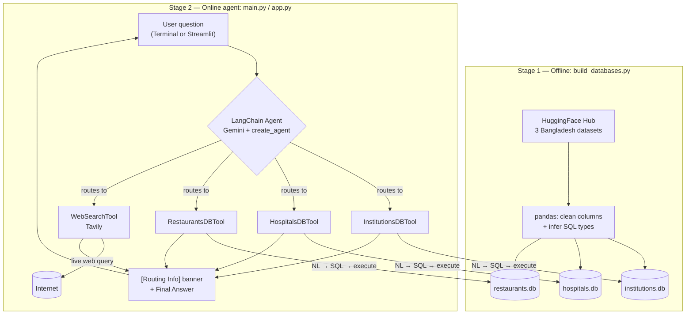

<div align="center">

# 🇧🇩 Bangladesh Multi-Tool AI Agent

*An LLM agent that automatically routes Bangladesh-related questions to the right tool — structured SQLite databases or live web search — and shows you exactly which one it picked.*


</div>

---

## 📚 Table of Contents

- [Overview](#-overview)
- [Features](#-features)
- [Architecture & Data Flow](#️-architecture--data-flow)
- [Tech Stack](#-tech-stack)
- [Project Structure](#-project-structure)
- [Prerequisites](#️-prerequisites)
- [Setup Guide](#️-setup-guide)
- [Running the Project](#️-running-the-project)
- [Diagnostic Tool: `list_models.py`](#-diagnostic-tool-list_modelspy)
- [Sample Queries & Routing Behavior](#-sample-queries--routing-behavior)
- [Streamlit Chat UI](#-streamlit-chat-ui)
- [Mock Mode (quota-free testing)](#-mock-mode-quota-free-testing)
- [Troubleshooting](#-troubleshooting)
- [Security Notes](#-security-notes)
- [License](#-license)

---

## 📖 Overview

Most "chat with your data" projects can only do one of two things well: answer precise questions against a structured database, *or* answer open-ended questions against the live web. This project does both — and **decides which one to use automatically**, based on the nature of the question.

Ask it *"How many hospitals in Dhaka have more than 200 beds?"* and it writes and executes a SQL query against a local SQLite database. Ask it *"What is the role of DGHS in regulating hospitals in Bangladesh?"* and it goes to the web instead, because that answer doesn't live in any spreadsheet. Every answer comes with a **`[Routing Info]`** banner showing exactly which tool made the decision — no black box.

**Datasets used** (via HuggingFace):

| Dataset | Source |
|---|---|
| Institutional Information of Bangladesh | `Mahadih534/Institutional-Information-of-Bangladesh` |
| All Bangladeshi Hospitals | `Mahadih534/all-bangladeshi-hospitals` |
| Bangladeshi Restaurant Data | `Mahadih534/Bangladeshi-Restaurant-Data` |

---

## ✨ Features

- 🏫 **Institutions tool** — universities, colleges, schools, government institutes
- 🏥 **Hospitals tool** — beds, doctors, facilities, hospital type
- 🍽️ **Restaurants tool** — cuisine, rating, location
- 🌐 **Web Search tool** (Tavily) — general background, policy, definitions, news
- 🧭 **Automatic tool routing** — one agent, zero manual switching
- 🔍 **Transparent routing** — every answer shows exactly which tool (or "Direct LLM Knowledge") answered it
- 🔒 **SQL safety guardrails** — every LLM-generated query is validated as read-only before execution
- 💬 **Two interfaces** — a terminal CLI (`main.py`) and a polished Streamlit web chat (`app.py`)
- 🧪 **Mock Mode** — test the entire UI/UX with zero real API calls, so you never burn quota while developing
- ⚡ **Quota-optimized** — DB tools skip a redundant LLM call by default, cutting Gemini requests per question
- 🩺 **Built-in diagnostics** (`list_models.py`) — see exactly which Gemini models your key can use, right now

---

## 🏗️ Architecture & Data Flow



**In words:**

1. **`build_databases.py`** downloads each HuggingFace dataset, cleans column names into `snake_case`, infers explicit SQL types (`TEXT`/`INTEGER`/`REAL`), and writes each into its own SQLite file.
2. **`db_tools.py`** wraps each database as a LangChain tool. Given a question, it asks the LLM for a safe read-only `SELECT` query grounded in that database's schema, validates it, executes it, and returns the result. (By default it skips a second "prettify into prose" LLM call, since the agent's own next turn already does that — see [Tech Stack](#-tech-stack).)
3. **`main.py`** wires all four tools into one LangChain agent and exposes it as an interactive terminal loop, printing a `[Routing Info]` line before every answer.
4. **`app.py`** is a Streamlit web chat UI on top of the *exact same* `main.py` logic — no duplicated agent code.

---

## 🧰 Tech Stack

| Layer | Technology |
|---|---|
| Data processing | pandas, SQLite3 |
| Dataset source | HuggingFace Hub (`datasets`, `huggingface_hub`) |
| Agent framework | LangChain (`create_agent`, LangGraph-based) |
| LLM | Google Gemini (`langchain-google-genai`) |
| Web search | Tavily (`langchain-tavily`) |
| Web UI | Streamlit |
| Config | `python-dotenv` |
| Diagnostics | `google-genai` (model listing) |

---

## 📁 Project Structure

```
bangladesh-ai-agent/
├── build_databases.py     # Downloads HF datasets, builds the 3 SQLite databases
├── db_tools.py             # 3 custom LangChain DB tools (NL → SQL → NL pipeline)
├── main.py                 # Agent setup, tool routing, interactive CLI loop
├── app.py                  # Streamlit web chat UI (reuses main.py's logic)
├── list_models.py          # Diagnostic: lists Gemini models available to your key
├── institutions.db         # Generated by build_databases.py
├── hospitals.db            # Generated by build_databases.py
├── restaurants.db          # Generated by build_databases.py
├── requirements.txt        # Python dependencies
├── .env                    # Your API keys (NOT committed — see .gitignore)
├── .gitignore
└── README.md
```

---

## ⚙️ Prerequisites

- **Python 3.10+**
- A **Google Gemini API key** — [aistudio.google.com/apikey](https://aistudio.google.com/apikey)
- A **Tavily API key** — [app.tavily.com](https://app.tavily.com/)
- Internet access (for the one-time dataset download, and for live web search at runtime)

---

## 🛠️ Setup Guide

### 1. Clone the repository

```bash
git clone <your-repo-url>
cd bangladesh-ai-agent
```

### 2. Create and activate a virtual environment

**Linux / macOS:**
```bash
python3 -m venv venv
source venv/bin/activate
```

**Windows (PowerShell):**
```powershell
python -m venv venv
venv\Scripts\Activate.ps1
```

### 3. Install dependencies

```bash
pip install -r requirements.txt
```

### 4. Configure your API keys

Create a `.env` file in the project root (already covered by `.gitignore` — **never commit this file or paste its contents anywhere public**):

```env
GEMINI_API_KEY=your-gemini-api-key-here
TAVILY_API_KEY=your-tavily-api-key-here
GEMINI_MODEL=gemini-3.5-flash-lite
```

> 💡 `GEMINI_MODEL` defaults to `gemini-3.5-flash-lite` here because, as of this writing, it's a stable (non-preview) model with a generous free-tier daily quota. **Model availability changes frequently and differs per account** — run [`list_models.py`](#-diagnostic-tool-list_modelspy) to confirm what's actually available to *your* key before relying on this default.

---

## ▶️ Running the Project

### Step 1 — Build the databases (run once)

```bash
python build_databases.py
```

Creates `institutions.db`, `hospitals.db`, and `restaurants.db`. Re-run any time to refresh the data.

### Step 2a — Run the CLI

```bash
python main.py
```

```
======================================================================
Bangladesh Multi-Tool AI Agent
(Institutions | Hospitals | Restaurants | Web Search)
======================================================================
Building agent...
Ready. Type your question below (type 'exit' or 'quit' to stop).
```

Type any question, press Enter. Type `exit` or `quit` to end.

### Step 2b — Run the Streamlit web UI

```bash
streamlit run app.py
```

Opens automatically at `http://localhost:8501` with a chat interface, sidebar quick-questions, and a Mock Mode toggle.

---

## 🩺 Diagnostic Tool: `list_models.py`

Gemini model names are retired and replaced often, and availability differs by account and project — a model that works today may 404 tomorrow, and vice versa. Instead of guessing, ask Google directly:

```bash
python list_models.py
```

```
======================================================================
Models you can use as GEMINI_MODEL (support generateContent):
======================================================================
  gemini-2.5-flash               (Gemini 2.5 Flash)
  gemini-2.5-flash-lite          (Gemini 2.5 Flash-Lite)
  gemini-flash-lite-latest       (Gemini Flash-Lite Latest)
  gemini-3.5-flash-lite          (Gemini 3.5 Flash Lite)
  ...
```

Pick any model from that list and set it as `GEMINI_MODEL` — no code changes needed.

---

## 💬 Sample Queries & Routing Behavior

Every answer is preceded by a `[Routing Info]` line showing exactly which tool answered (or `Direct LLM Knowledge`/an error state). Numbers below are illustrative.

**Structured data → Database Tool**
```
==================================================
You: How many hospitals are located in Dhaka?
[Routing Info] Tool Selected: HospitalsDBTool (hospitals.db)
--------------------------------------------------
Agent: There are 128 hospitals located in Dhaka according to the database.
==================================================
```

**Background/policy → Web Search Tool**
```
==================================================
You: What is the role of DGHS in Bangladesh's healthcare system?
[Routing Info] Tool Selected: WebSearchTool (Tavily)
--------------------------------------------------
Agent: The Directorate General of Health Services (DGHS) is the technical
and administrative wing of Bangladesh's Ministry of Health and Family
Welfare, overseeing public healthcare delivery nationwide.
==================================================
```

**Mixed question → Both tools combined**
```
==================================================
You: How many public hospitals are in Dhaka, and what policy governs them?
[Routing Info] Tool Selected: HospitalsDBTool (hospitals.db), WebSearchTool (Tavily)
--------------------------------------------------
Agent: There are 42 public hospitals in Dhaka according to the database.
These fall under Bangladesh's National Health Policy, administered by DGHS.
==================================================
```

**General knowledge → No tool needed**
```
==================================================
You: What is the capital of Bangladesh?
[Routing Info] Tool Selected: Direct LLM Knowledge
--------------------------------------------------
Agent: The capital of Bangladesh is Dhaka.
==================================================
```

---

## 🖥️ Streamlit Chat UI

`app.py` layers a full web chat experience on top of `main.py` — no agent logic is duplicated:

- 🎨 Custom-styled header and tool chips (🏫🏥🍽️🌐)
- 💬 Persistent chat history via `st.session_state`
- 👤 Distinct avatars for user (🧑‍💻) and assistant (🇧🇩)
- 🔍 The same `[Routing Info]` banner as the CLI, rendered with `st.info()`
- ⌨️ Word-by-word streamed answers for a live "typing" feel
- ⚡ Sidebar quick-question buttons (one click = instant question)
- 🗑️ "Clear conversation" button
- 🧪 **Mock Mode toggle** for zero-API-call UI testing

The agent itself is built once per server process via `@st.cache_resource` — not rebuilt on every message.

---

## 🧪 Mock Mode (quota-free testing)

Free-tier Gemini quotas are small and easy to exhaust while iterating on UI/UX. The sidebar's **🧪 Mock Mode** toggle bypasses the real agent entirely and returns instant, scripted answers based on simple keyword matching — **zero network calls**, so it never touches your Gemini or Tavily quota. Use it to polish styling and flow, then switch it off to get real answers once you're ready.

---

## 🧯 Troubleshooting

**`429 RESOURCE_EXHAUSTED` / quota exceeded:**
This is the Gemini **free tier's daily request quota** for that specific model (e.g. `20/day` on some preview models) — not a broken key.
- Free-tier daily quotas reset at a **fixed clock time — midnight Pacific Time** — not "24 hours after your last call." If it's still the same Pacific calendar day, waiting a few hours won't help.
- Check your **real, live usage** at [aistudio.google.com/rate-limit](https://aistudio.google.com/rate-limit) instead of guessing.
- Run `python list_models.py` and switch `GEMINI_MODEL` to an established (non-preview) model — these generally carry higher free-tier limits than brand-new preview models.
- Quota is calculated **per Google Cloud project**, not per API key — a new key in the *same* project won't help; you need a genuinely new project (AI Studio's "Create API key" flow lets you pick "Create a new project").
- Turn on **Mock Mode** while iterating on UI so you don't burn real quota during development.
- For reliable, frequent use, enable billing on your Gemini project — the free tier is meant for light testing only.

**`404 NOT_FOUND` mentioning a model name:**
Google retires model names over time and availability differs per account. Run `python list_models.py` to see what's actually available to your key right now, and set `GEMINI_MODEL` accordingly.

**`AttributeError: 'list' object has no attribute 'strip'`:**
Some Gemini responses return `.content` as a list of content blocks instead of a plain string. `db_tools.py` normalizes this automatically via `_message_content_to_text()` — make sure you're on the latest version of that file.

**Stale environment variables in an active shell:**
If you change `.env` but a PowerShell/terminal session already has an old `$env:GEMINI_API_KEY` or `$env:GEMINI_MODEL` set, that stale value wins over `.env`. Clear it explicitly:
```powershell
Remove-Item Env:GEMINI_API_KEY -ErrorAction SilentlyContinue
Remove-Item Env:GEMINI_MODEL -ErrorAction SilentlyContinue
```

---

## 🔐 Security Notes

- API keys are read from environment variables / a local `.env` file — never hardcoded in source.
- `.env`, `*.pem`, and `*.key` must stay in `.gitignore` and out of version control, chat logs, and screenshots.
- Every SQL query generated by the LLM is validated as a single, read-only `SELECT` statement before execution; write/DDL statements (`INSERT`, `UPDATE`, `DELETE`, `DROP`, `ALTER`, `PRAGMA`, etc.) are blocked.
- **If a key is ever exposed** (committed, pasted in a chat, shared in a screenshot), rotate it immediately from the provider's dashboard — don't just remove it from the visible copy.

---

## 📄 License

Add your chosen license here (e.g. MIT).

<div align="center">

**তৈরি হয়েছে বাংলাদেশের ওপেন ডেটা নিয়ে কাজ করার জন্য 🇧🇩**

</div>
