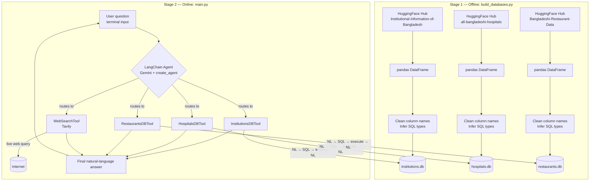

# 🇧🇩 Bangladesh Multi-Tool AI Agent

An LLM-powered research assistant that answers natural-language questions about **Bangladeshi institutions, hospitals, and restaurants** by intelligently routing each query to either a **structured SQLite database tool** or a **live web search tool**, depending on what kind of answer the question actually needs.

Built with **LangChain's `create_agent`**, **Google Gemini**, and **Tavily Search**, on top of three open datasets from the HuggingFace Hub.

---

## 📖 Overview

Most "chat with your data" projects can only do one of two things well: answer precise questions against a structured database, *or* answer open-ended questions against the live web. This project does both, and — critically — **decides which one to use automatically**, based on the nature of the question.

Ask it *"How many hospitals in Dhaka have more than 200 beds?"* and it writes and executes a SQL query against a local SQLite database. Ask it *"What is the role of DGHS in regulating hospitals in Bangladesh?"* and it goes to the web instead, because that answer doesn't live in any spreadsheet.

**Core capabilities:**

- 🏫 **Institutions** — universities, colleges, schools, and government institutes (name, type, location, capacity)
- 🏥 **Hospitals** — hospital name, location, beds, doctors, facilities, and type (public/private/specialized)
- 🍽️ **Restaurants** — restaurant name, cuisine, location, and rating
- 🌐 **Web Search** — general background, definitions, policy, and news that isn't in any local database
- 🧭 **Automatic tool routing** — a single agent decides, per question, which tool(s) to call — no manual switching required
- 🔒 **SQL safety guardrails** — every LLM-generated query is validated as read-only (`SELECT`-only) before it ever touches the database

**Datasets used** (via HuggingFace):

| Dataset | Source |
|---|---|
| Institutional Information of Bangladesh | `Mahadih534/Institutional-Information-of-Bangladesh` |
| All Bangladeshi Hospitals | `Mahadih534/all-bangladeshi-hospitals` |
| Bangladeshi Restaurant Data | `Mahadih534/Bangladeshi-Restaurant-Data` |

---

## 🏗️ Architecture & Data Flow

The project is a two-stage pipeline: an **offline data-preparation stage** (run once) and an **online agent stage** (run every time you ask a question).



**In words:**

1. **`build_databases.py`** downloads each HuggingFace dataset, cleans its column names into `snake_case`, infers explicit SQL column types (`TEXT` / `INTEGER` / `REAL`), and writes each one into its own standalone SQLite file.
2. **`db_tools.py`** wraps each database in a LangChain `BaseTool`. Each tool takes a plain-English question, asks an LLM to translate it into a safe, read-only `SELECT` query grounded in that database's schema, executes it, and asks the LLM again to turn the raw rows into a clean natural-language answer.
3. **`main.py`** wires the three DB tools plus a Tavily web-search tool into a single LangChain agent (Gemini as the reasoning model). A system prompt instructs the agent on which tool to call for which kind of question. The agent runs in an interactive terminal loop.

---

## ⚙️ Prerequisites

- **Python 3.10+**
- A **Google Gemini API key** — [get one here](https://aistudio.google.com/app/apikey)
- A **Tavily API key** — [get one here](https://app.tavily.com/)
- Internet access (to download the HuggingFace datasets once, and for live web search at runtime)

---

## 🛠️ Setup Guide

### 1. Clone the repository

```bash
git clone <your-repo-url>
cd bangladesh-ai-agent
```

### 2. Create and activate a virtual environment

**Linux / macOS:**
```bash
python3 -m venv venv
source venv/bin/activate
```

**Windows (PowerShell):**
```powershell
python -m venv venv
venv\Scripts\Activate.ps1
```

### 3. Install dependencies

```bash
pip install -r requirements.txt
```

`requirements.txt` includes:

```
pandas
datasets
huggingface_hub
langchain
langchain-core
langchain-community
langchain-google-genai
langchain-tavily
python-dotenv
```

### 4. Configure your API keys

Create a `.env` file in the project root (never commit this file — it's already covered by `.gitignore`):

```env
GEMINI_API_KEY=your-gemini-api-key-here
TAVILY_API_KEY=your-tavily-api-key-here
```

`main.py` loads this automatically via `python-dotenv`. Alternatively, you can export the variables directly in your shell for the current session:

**Linux / macOS:**
```bash
export GEMINI_API_KEY="your-gemini-api-key-here"
export TAVILY_API_KEY="your-tavily-api-key-here"
```

**Windows (PowerShell):**
```powershell
$env:GEMINI_API_KEY="your-gemini-api-key-here"
$env:TAVILY_API_KEY="your-tavily-api-key-here"
```

> ⚠️ **Security note:** Never paste real API keys into chat tools, commit them to git, or share screenshots containing them. If a key is ever exposed, rotate it immediately from the provider's dashboard.

---

## ▶️ Running the Project

### Step 1 — Build the databases (run once)

```bash
python build_databases.py
```

This downloads the three HuggingFace datasets and creates `institutions.db`, `hospitals.db`, and `restaurants.db` in the project root. You'll see per-dataset progress and a final success/failure summary printed to the terminal. Re-run this any time you want to refresh the data — it overwrites the existing `.db` files.

### Step 2 — Run the agent

```bash
python main.py
```

You'll be dropped into an interactive prompt:

```
======================================================================
Bangladesh Multi-Tool AI Agent
(Institutions | Hospitals | Restaurants | Web Search)
======================================================================
Building agent...
Ready. Type your question below (type 'exit' or 'quit' to stop).

You:
```

Type any question and press Enter. Type `exit` or `quit` to end the session.

---

## 💬 Sample Queries & Routing Behavior

Every answer is preceded by a `[Routing Info]` line showing exactly which tool the agent invoked (or `Direct LLM Knowledge` if it answered without calling any tool), so the routing decision is visible before the final answer. The examples below illustrate how different question *types* get routed — exact wording/numbers will vary by run.

### Example 1 — Structured data question → Database Tool

```
==================================================
You: How many hospitals are located in Dhaka?
[Routing Info] Tool Selected: HospitalsDBTool (hospitals.db)
--------------------------------------------------
Agent: There are 128 hospitals located in Dhaka according to the database.
==================================================
```

**What happened under the hood:** the question named a countable, structured attribute ("how many hospitals... in Dhaka") that maps directly onto columns in `hospitals.db`, so the agent called `hospitals_db_tool`, which generated and validated a `SELECT COUNT(*)` query, ran it, and summarized the result — no web search involved.

### Example 2 — Entity lookup → Database Tool

```
==================================================
You: Which restaurants in Gulshan have a rating above 4?
[Routing Info] Tool Selected: RestaurantsDBTool (restaurants.db)
--------------------------------------------------
Agent: Restaurants in Gulshan rated above 4 include Sultan's Dine (4.6),
Fakruddin Biriyani (4.5), and Takeout Dhaka (4.2).
==================================================
```

### Example 3 — Background/policy question → Web Search Tool

```
==================================================
You: What is the role of DGHS in Bangladesh's healthcare system?
[Routing Info] Tool Selected: WebSearchTool (Tavily)
--------------------------------------------------
Agent: The Directorate General of Health Services (DGHS) is the technical and
administrative wing of Bangladesh's Ministry of Health and Family Welfare.
It oversees the planning, management, and delivery of public healthcare
services nationwide, including hospital administration, disease control
programs, and health workforce management.
==================================================
```

**What happened under the hood:** "DGHS's role" is a definitional/institutional-policy question that doesn't correspond to any column in `institutions.db`, `hospitals.db`, or `restaurants.db` — so the agent skipped the database tools entirely and called `tavily_search` instead.

### Example 4 — Mixed question → Both tool types combined

```
==================================================
You: How many public hospitals are in Dhaka, and what national policy governs them?
[Routing Info] Tool Selected: HospitalsDBTool (hospitals.db), WebSearchTool (Tavily)
--------------------------------------------------
Agent: There are 42 public hospitals in Dhaka according to the database.
These fall under Bangladesh's National Health Policy, which is administered
by DGHS and sets standards for public hospital staffing, infrastructure,
and service delivery nationwide.
==================================================
```

The agent is instructed (via its system prompt) to combine both tools into a single coherent answer whenever a question has both a data-lookup part and a background/policy part.

### Example 5 — General knowledge → No tool called

```
==================================================
You: What is the capital of Bangladesh?
[Routing Info] Tool Selected: Direct LLM Knowledge
--------------------------------------------------
Agent: The capital of Bangladesh is Dhaka.
==================================================
```

If a question doesn't require a database lookup or a live web search, the agent may answer directly from its own knowledge — in that case `[Routing Info]` shows `Direct LLM Knowledge` instead of a tool name.

---

## 📁 Project Structure

```
bangladesh-ai-agent/
├── build_databases.py     # Downloads HF datasets, builds the 3 SQLite databases
├── db_tools.py             # 3 custom LangChain DB tools (NL → SQL → NL pipeline)
├── main.py                 # Agent setup, tool routing, interactive CLI loop
├── test_agent.py           # (Optional) automated test script
├── institutions.db         # Generated by build_databases.py
├── hospitals.db            # Generated by build_databases.py
├── restaurants.db          # Generated by build_databases.py
├── requirements.txt        # Python dependencies
├── .env                    # Your API keys (not committed — see .gitignore)
└── README.md                # This file
```

---

## 🧰 Tech Stack

| Layer | Technology |
|---|---|
| Data processing | pandas, SQLite3 |
| Dataset source | HuggingFace Hub (`datasets`, `huggingface_hub`) |
| Agent framework | LangChain (`create_agent`) |
| LLM | Google Gemini (`langchain-google-genai`) |
| Web search | Tavily (`langchain-tavily`) |
| Config | `python-dotenv` |

---

## 🔐 Security Notes

- API keys are read from environment variables / a local `.env` file — never hardcoded in source.
- Every SQL query generated by the LLM is validated as a single, read-only `SELECT` statement before execution; write/DDL statements (`INSERT`, `UPDATE`, `DELETE`, `DROP`, `ALTER`, `PRAGMA`, etc.) are blocked.
- `.env`, `*.pem`, and `*.key` files should always stay in `.gitignore` and out of version control.

---

## 🧯 Troubleshooting

**`429 RESOURCE_EXHAUSTED` / quota exceeded error:**
This means the Gemini **free tier** daily request quota for the model (e.g. 20 requests/day on `gemini-3.6-flash`) has been used up — it is not an invalid or broken API key. Options:
- Wait for the daily quota to reset (resets ~24 hours after first use that day), then rerun with the same key.
- Reduce request volume during testing (each question can trigger multiple model calls: routing + per-tool SQL generation + answer summarization).
- Enable billing / upgrade your Gemini API plan for higher limits — see [Gemini API rate limits](https://ai.google.dev/gemini-api/docs/rate-limits).

**`404 NOT_FOUND` mentioning a model name:**
Google periodically retires older model names. Check [available models](https://ai.google.dev/gemini-api/docs/models) and set `GEMINI_MODEL` (env var) to a currently supported one — no code changes needed.

---

## 📄 License

Add your chosen license here (e.g. MIT).